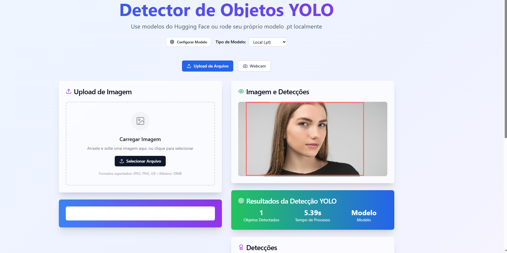
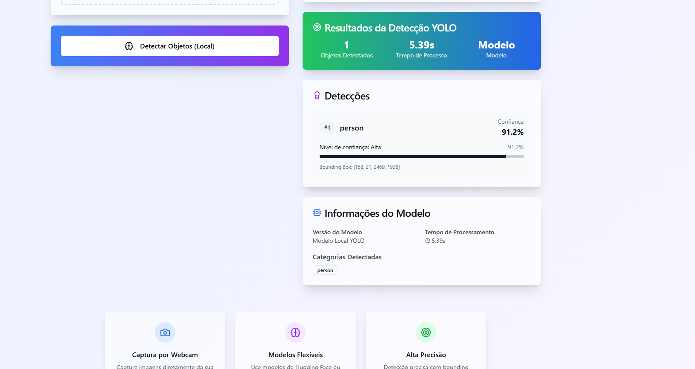
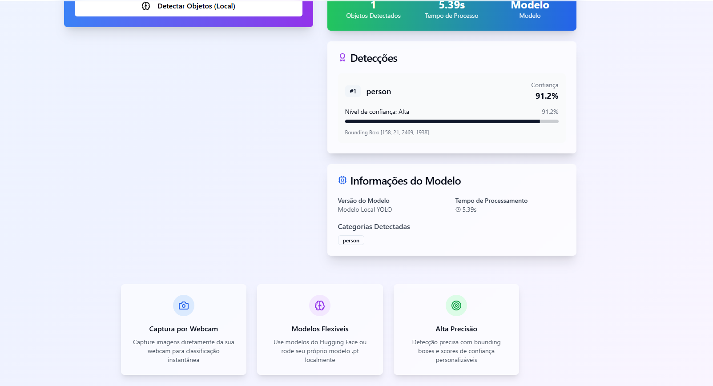

# Classificador de Imagens

Bem-vindo ao repositório do **Classificador de Imagens**, uma aplicação desenvolvida como entrega da Ponderada da Semana 10, orientada pelo professor **Murilo Zanini**.

O projeto consiste em uma aplicação **React** que se comunica com um modelo treinado em **PyTorch (.pth)**, capaz de identificar diversas classes visuais em imagens.

## Classes Reconhecidas

O modelo pode classificar imagens nas seguintes categorias:

- Maçã  
- Banana  
- Pássaro  
- Menino  
- Brócolis  
- Ônibus  
- Bolo  
- Carro  
- Cenoura  
- Gato  
- Cadeira  
- Cachorro  
- Menina  
- Homem  
- Mulher  
- Moto  
- Laranja  
- Pessoa  
- Pizza  
- Salada  
- Morango  

> Obs.: Algumas classes podem se sobrepor semanticamente (como *Mulher* e *Pessoa*), mas estão presentes no treinamento como categorias distintas.

## Como foi feito?

Utilizei o dataset **OpenImages**, desenvolvido pelo Google, que contém milhares de imagens etiquetadas com diversas classes, incluindo todas as citadas acima.

O modelo foi treinado com **PyTorch**, e a aplicação front-end foi construída em **React**.

---

## Como rodar o projeto?

### 1. Clone o repositório

Abra um terminal e execute o seguinte comando:

```bash
git clone https://github.com/Fernandoliveira05/classificador_de_imagens.git
```
---

### 2. Instale as dependências do front-end

Navegue até a pasta `src` dentro de `Codigos (SRC)` e instale as dependências do React:

``` bash
npm install
```
---

### 3. Configure o servidor Python

1. Navegue até a pasta `python_yolo`.  
2. Instale os requisitos com o seguinte comando:

``` bash
pip install -r requirements.txt
``` 
3. Para iniciar o servidor backend com o modelo, você pode usar:

``` bash
> `uvicorn python_server_example:app --host 0.0.0.0 --port 8000 --reload`
``` 

Você também pode tentar desse jeito:
``` bash
> `python python_server_example.py`
```
---

### 4. Rode o front-end

Volte para a raiz da pasta `src` e execute o seguinte comando para iniciar o projeto React:

``` bash 
npm run dev
``` 
---

## Pronto!

Se tudo estiver certo, você terá acesso à aplicação completa via navegador, com interface gráfica e comunicação funcionando com o modelo.

---
## Imagens da Aplicação Rodando







---

💬 Caso tenha sugestões ou encontre algum problema, fique à vontade para abrir uma issue ou enviar um pull request.
